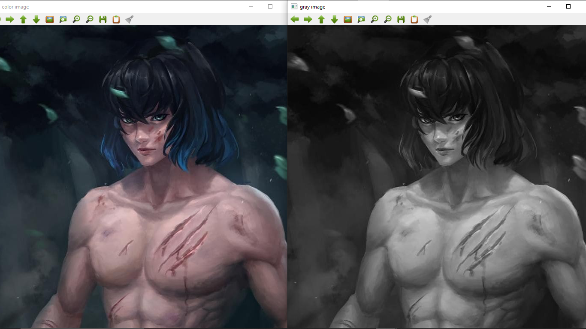
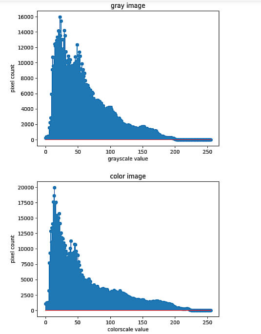
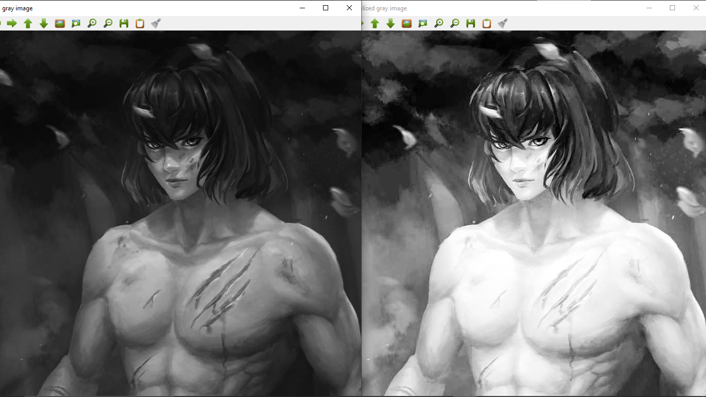

# Histogram and Histogram Equalization of an image

## Aim

To obtain a histogram for finding the frequency of pixels in an Image with pixel values ranging from 0 to 255. Also write the code using OpenCV to perform histogram equalization.

## Software Required:

Anaconda - Python 3.7

## Algorithm:

### Step1:

Read the gray and color image using imread()

### Step2:

Print the image using imshow().

### Step3:

Use calcHist() function to mark the image in graph frequency for gray and color image.

### Step4:

cv2.equalize() is used to transform the gray image to equalized form.

### Step5:

The Histogram of gray scale image and color image is shown.

## Program:

### Developed By: SRIJITH R

### Register Number: 212221240054

```python
# Code to find the histogram of gray scale image and color image channels.
import cv2
import matplotlib.pyplot as plt

gray=cv2.imread("kenma.jpg",0)
cv2.imshow('gray image',gray)
color=cv2.imread("kenma.jpg",1)
cv2.imshow('color image',color)

cv2.waitKey(0)
cv2.destroyAllWindows()

# Display the histogram of gray scale image and any one channel histogram from color image
gray_hist=cv2.calcHist([gray],[0],None,[256],[0,255])
color_hist=cv2.calcHist([color],[2],None,[256],[0,255])

plt.figure()
plt.title("gray image")
plt.xlabel("grayscale value")
plt.ylabel("pixel count")
plt.stem(gray_hist)
plt.show()

plt.figure()
plt.title("color image")
plt.xlabel("colorscale value")
plt.ylabel("pixel count")
plt.stem(color_hist)
plt.show()


# Code to perform histogram equalization of the image.
gray_equalized=cv2.equalizeHist(gray)

cv2.imshow('gray image',gray)
cv2.imshow('equalized gray image',gray_equalized)
cv2.waitKey(0)
cv2.destroyAllWindows()

```

## Output:

### Input Grayscale Image and Color Image



### Histogram of Grayscale Image and any channel of Color Image



### Histogram Equalization of Grayscale Image



## Result:

Thus the histogram for finding the frequency of pixels in an image with pixel values ranging from 0 to 255 is obtained. Also,histogram equalization is done for the gray scale image using OpenCV.
